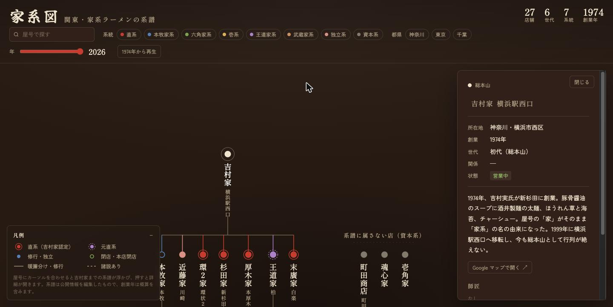

# 家系ラーメン家系図

**▶ https://iekei-keizu.vercel.app** — ブラウザで開くだけで使えます（PC・スマホ対応、インストール不要）

吉村家を頂点に、関東の家系ラーメン27店・6世代の修行系譜を、縦書き屋号の伝統的な系図様式で辿れる Web アプリです。

[](https://iekei-keizu.vercel.app)

## 使い方

| やりたいこと | 操作 |
|---|---|
| 系図を眺める | ドラッグで移動、ホイール / ピンチで拡大縮小。右下の `⊡` で全体表示に戻る |
| ある店の系譜を知る | 屋号にカーソルを合わせると、吉村家までの系譜が浮かび上がる |
| 店の詳細を見る | 屋号を押すと右にパネルが開く。所在地・創業年・世代・師匠と弟子の一覧 |
| **店の場所を調べる** | パネルの **「Google マップで開く ↗」** で Google マップが別タブで開く |
| 系統・都県で絞る | 上部のチップ（直系 / 本牧家系 / 六角家系 … 、神奈川 / 東京 / 千葉）を押す |
| 屋号で探す | 左上の検索欄に入力 |
| 歴史を追う | 年スライダーを動かすか **「1974年から再生」** で、暖簾が広がる様子をアニメーションで見る |

### 凡例の読み方

| 印 | 意味 |
|---|---|
| 赤の二重丸 | 直系（吉村家認定） |
| 紫の点線二重丸 | 元直系（認定を離脱） |
| 単色の丸 | 修行・独立（色は系統を表す） |
| 白抜きの丸 | 閉店・本店閉店 |
| 実線 | 暖簾分け・修行 |
| 点線 | 諸説あり |

町田商店などの資本系は修行の系譜に属さないため、系図の右に別置きしています。

## データについて

系譜は公開情報を編集したものです。創業年は概算（「頃」表記）を含み、系譜上の位置づけに諸説ある店は点線で示しています。誤りや追加したい店があれば [Issue](https://github.com/miyata09x0084/iekei-keizu/issues) でお知らせください。

---

## 開発

Next.js（App Router / TypeScript）+ D3.js。静的出力（`output: 'export'`）なので任意の静的ホスティングに置けます。
本番は Vercel（Hobby）でホストしており、`main` への push で自動デプロイされます。

```sh
npm install
npm run dev     # http://localhost:3000
npm run build   # out/ に静的サイトを出力
npm run lint
```

### 構成

- `src/data/shops.ts` — 店舗データと型（`Shop`）、系統・関係・状態のラベル
- `src/lib/layout.ts` — d3.tree による座標計算と系線の生成（純粋関数）
- `src/lib/ancestry.ts` — 系譜の遡り、絞り込み判定
- `src/components/TreeCanvas.tsx` — D3 が SVG を専有する描画面。React は class の付け替えだけを伝える
- `src/components/Keizu.tsx` — 絞り込み・検索・年スライダー・選択の状態管理
- `src/components/DetailPanel.tsx` / `Legend.tsx`

### データの編集

`src/data/shops.ts` の `NODES` 配列に店舗を追加・修正してください。型が付いているので、値の誤りはビルド時に検出されます。

```ts
{ id: "example", name: "屋号", sub: "地名", pref: "神奈川", city: "横浜市", founded: 2020, approx: true,
  parent: "yoshimura", lineage: "direct", status: "open", edge: "direct", note: "解説",
  map: "https://www.google.com/maps/place/?q=place_id:ChIJ..." }
```

- `parent`: 師匠となる店の `id`（資本系は `null`）
- `lineage`: `direct` / `honmoku` / `rokkaku` / `ichi` / `oudou` / `musashi` / `indep` / `capital`
- `edge`: `direct`（直系認定）/ `former`（元直系）/ `trained`（修行・独立）/ `disputed`（諸説あり）
- `status`: `open` / `closed` / `main-closed`
- `map`（任意）: その店の Google マップ URL。登録すると詳細パネルに「Google マップで開く」リンクが出る（未登録なら非表示）。
  `https://www.google.com/maps/place/?q=place_id:<Place ID>` の形式なら店名検索に頼らず確実にその店を指せる。
  本店閉店（`main-closed`）の店は暖簾を継承する店舗にリンクする。登録前に Google マップ側の店名・住所が `city` と一致することを確認する
